# 概述

## 图片

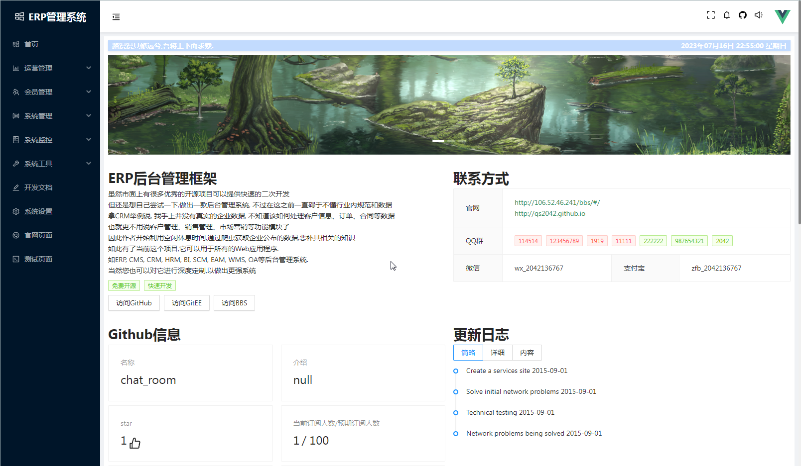
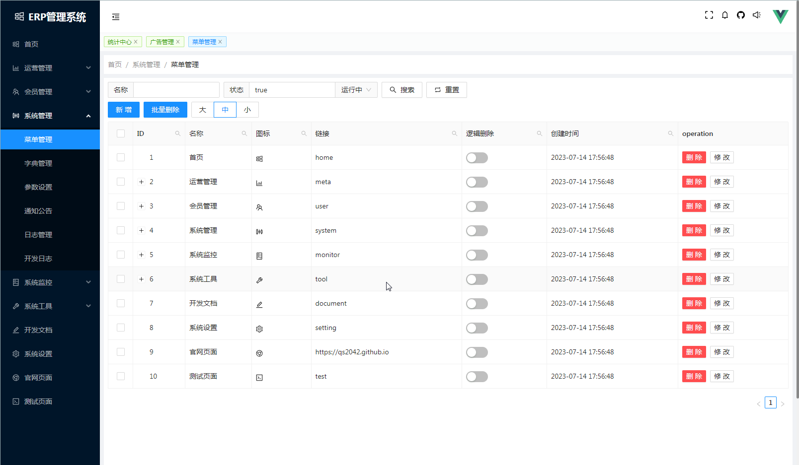
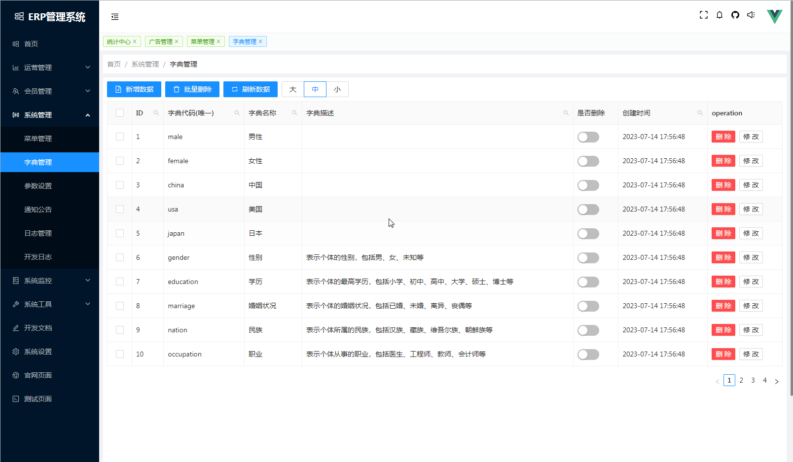
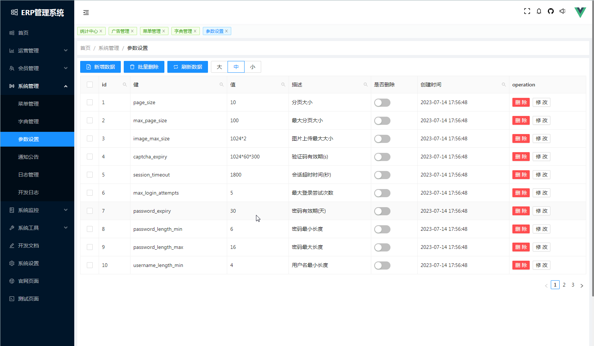
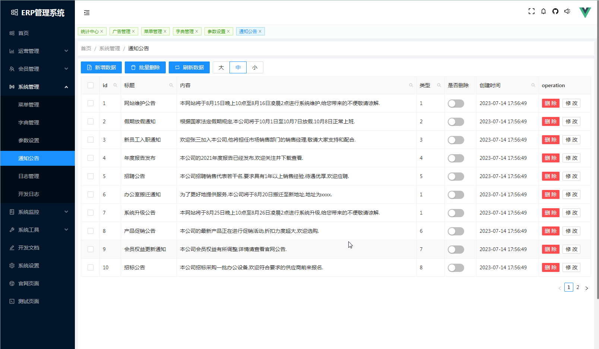
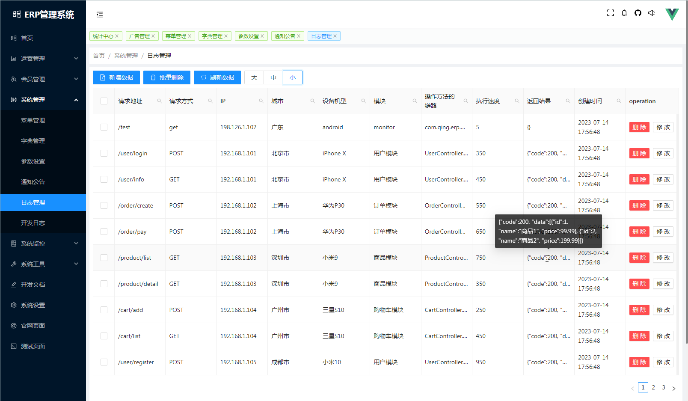
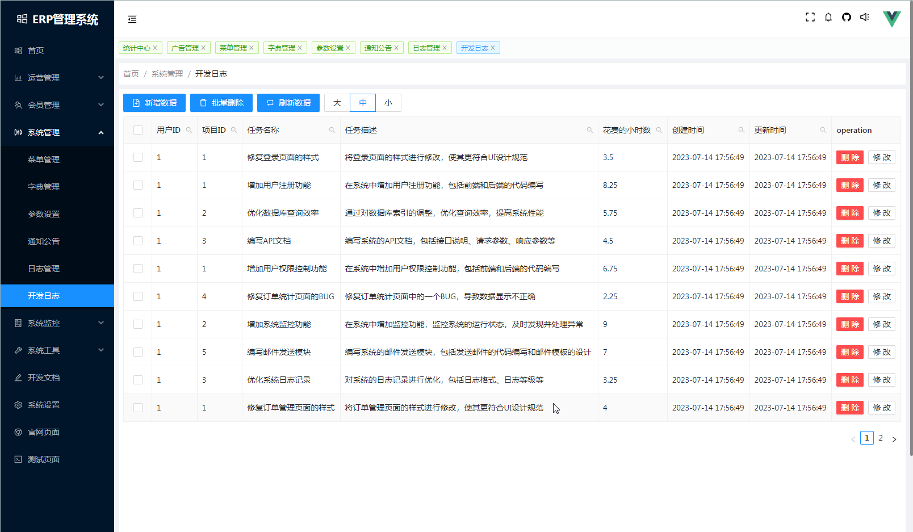
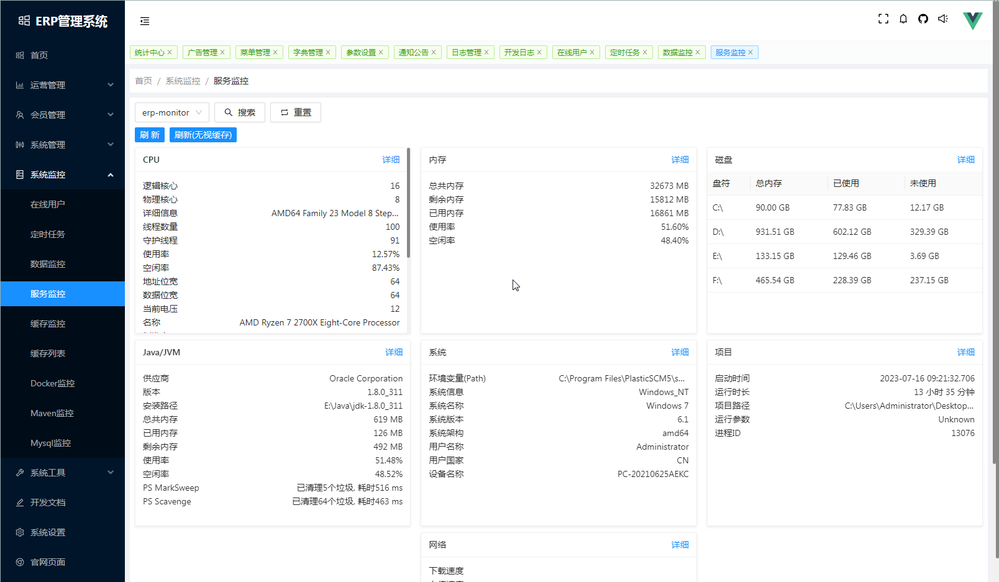
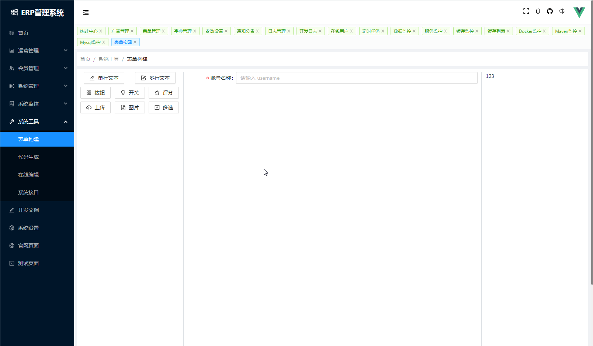
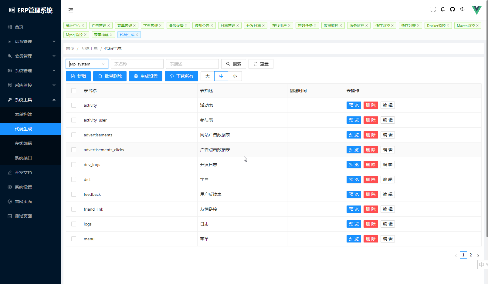
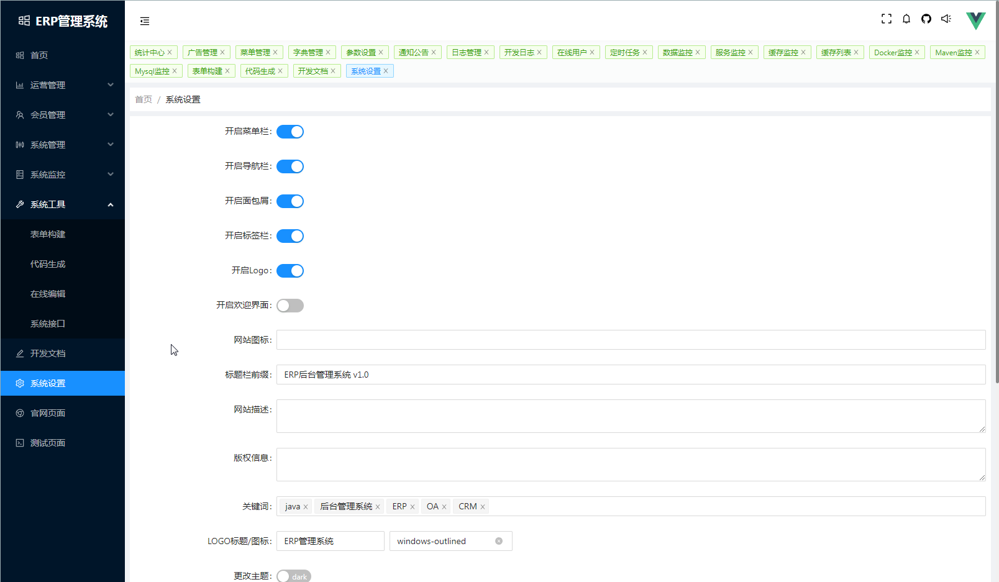
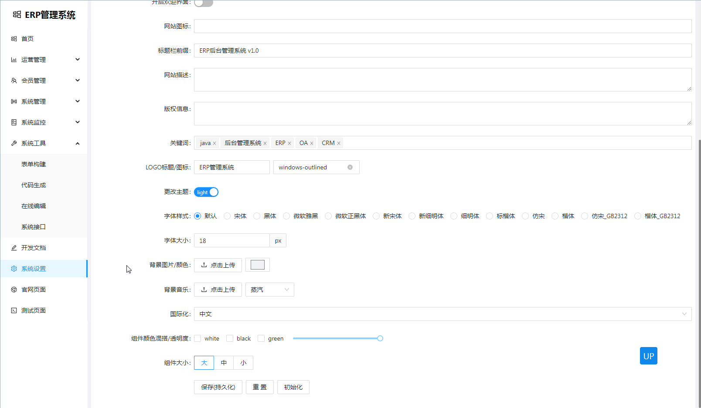
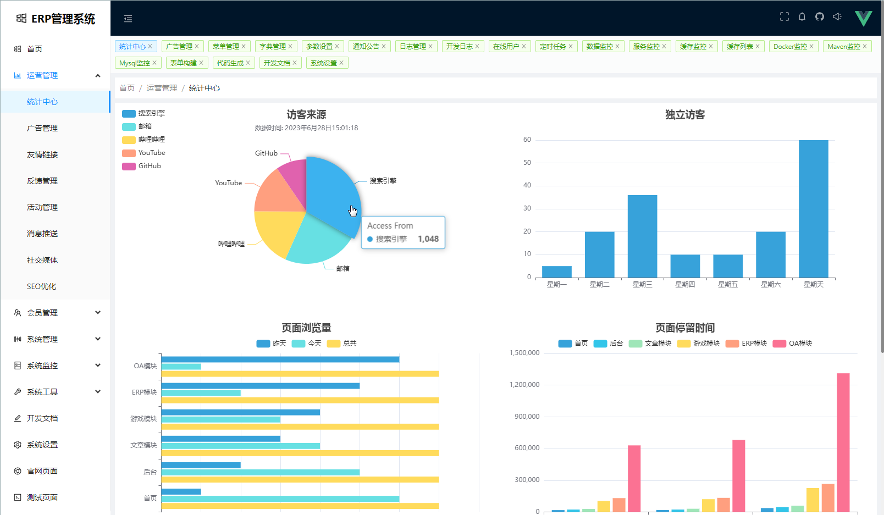
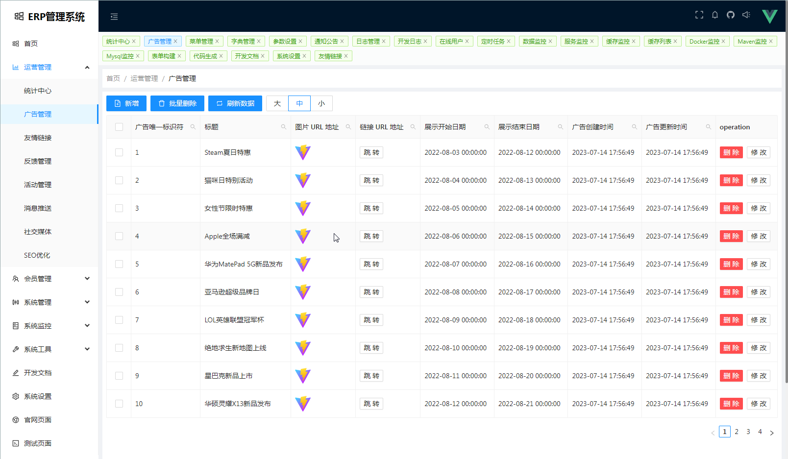
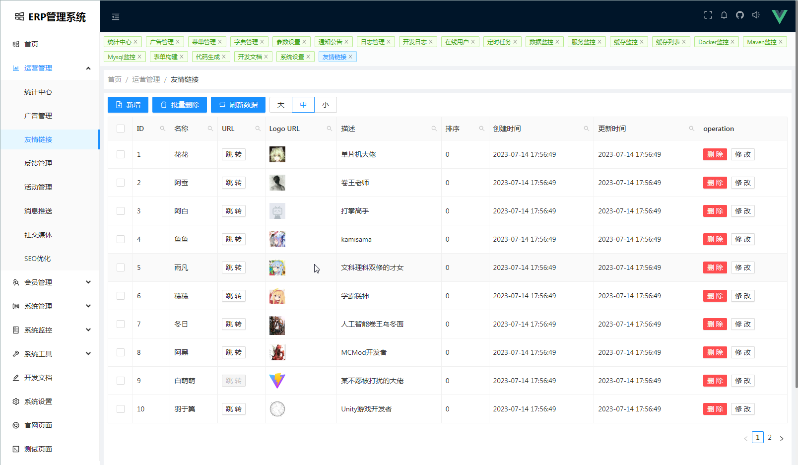
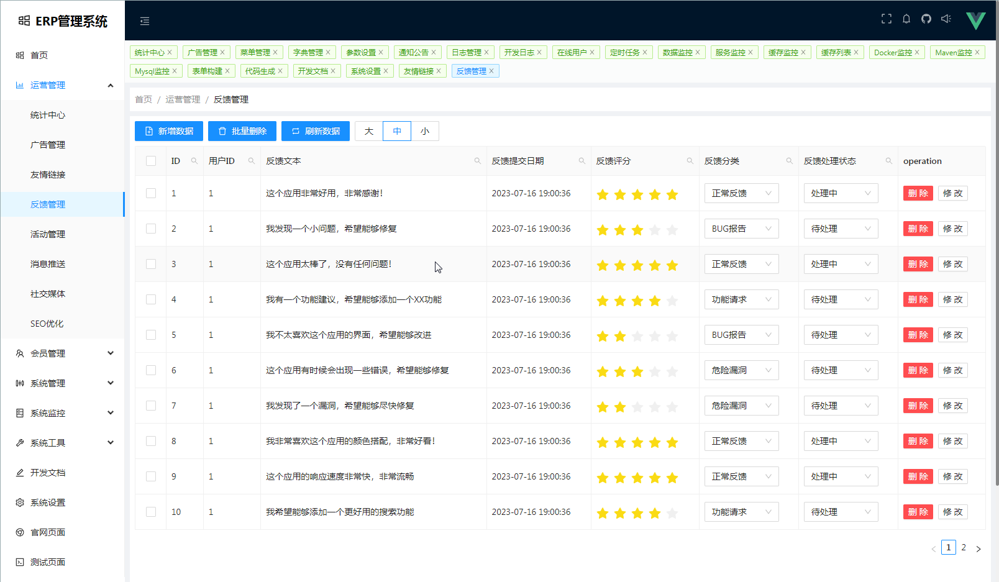
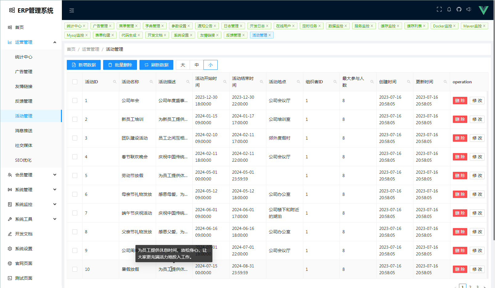
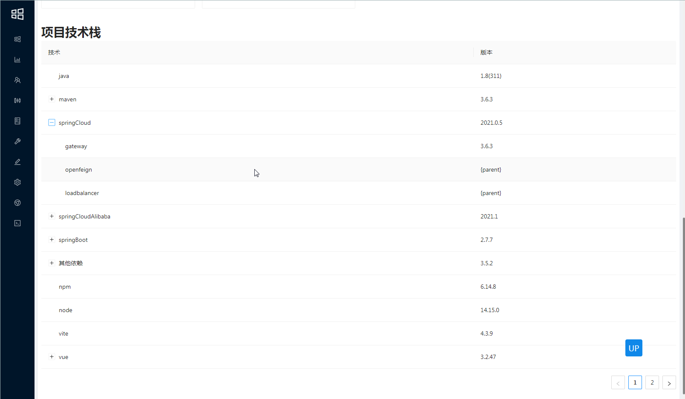

## 模块介绍

| service | port | introduce | notes
|:---:|:---:|:---:|:---:|
| rainfall-module      | ..... | 基类       | ...
| rainfall-common      | ..... | 工具类     | ...
| rainfall-gateway     |  88   | 网关服务   | ...
| rainfall-oss         | 5000  | 文件储存   | ...
| rainfall-search      | 6000  | 全局搜索   | ...
| rainfall-thirdparty  | 7000  | 第三方服务 | ...
| rainfall-member      | 8000  | 用户服务   | ...
| rainfall-system      | 9000  | 系统管理   | ...
| rainfall-erp         | 10000 | ERP服务   | 仓库,销售,财务
| rainfall-auth-server | 11000 | 认证中心   | ...

## 模块树

```text
Rainfall
├── rainfall-auth-server
├── rainfall-common
├── rainfall-gateway
├── rainfall-member
├── rainfall-module
├── rainfall-oss
├── rainfall-search
├── rainfall-system
└── rainfall-thirdparty
```

## 技术点

**环境**

虚拟机: VWare

linux: centos 8

docker

**前端**

框架: nodejs + vue3 + vite + nginx

语言: ts

UI: antd+bootstrap5

数据可视化: echarts

状态管理: pinia

工具: qs, axios, html2canvas

**后端**

注册中心, 配置中心: nacos

网关: gateway

校验: JSR303校验

oss: minio + 本地储存 + 阿里云OSS

检索: ES+Kibana

后台: 自定义后台 + 人人开源

# 教程

## 搭建环境

查看 "搭建环境.md" 文档

## 克隆项目

```shell
git clone [github仓库地址]
```

执行sql

启动nacos

启动docker

启动nginx

填写配置

启动gateway, member, oss, system

## 增删改查

0.创建自己的模块 0.增加菜单 0.生成增删改查代码 0.增加网关 0.测试功能

## 自定义页面内容

...

## 接入在线人数模块

...

## 接入定时任务模块

...

## 接口规范格式

```json5
{
  code: "int",
  data: {
    // 树结构
    tree: {},
    // 列表结构
    list: [],
    // map结构
    map: {},
    // page结构
    page: {}
    // other
  },
  msg: ""
}
```

# TODO

0. 代码自动生成
    - 缓存
    - 权限校验
    - 事务管理
    - 异步支持
0. Rabbit
0. ELK
0. 微信支付宝支付SDK
0. 认证中心
0. sentinel
0. 消息中间件
0. sleuth
0. zipkin
0. k8s
0. kubeSphere
0. 分布式事务